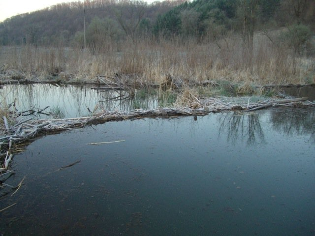

```{r setup, include=FALSE}
library(tidyverse)
library(openxlsx)
library(plotly)

knitr::opts_chunk$set(echo = TRUE)
composite<-read.xlsx("Kickapoo Watershed Final Analysis All Data (Augustana_ Snapshot_ Iowa DNR) (1) (1).xlsx",sheet = 'Composite Data Su19 Sampling Ev',detectDates = T)
```

## Introduction

In this study, we intend to explore the water quality in the Kickapoo Watershed. For exploring the water quality using this dataset, different data cleaning steps were performed.



Through the study we can observe that the concentrations of ammonia, chloride, discharge, dissolved oxygen saturation, nitrate, pH, phosphate, specific conductivity, sulfate, total BOD, total dissolved solids, total suspended solids, and water temperature. Ammonia concentrations didn't change significantly over time, chloride concentrations slightly increased, discharge (m3/sec) slightly increased, dissolved oxygen saturation moderately increased, nitrate concentration highly increased, pH was becoming alkaline, phosphate (PO4-P mg/L), specific conductivity (S), sulfate (mg/l), total BOD (mg/L), total dissolved solids (mg/l), total suspended solids (mg/l), and water temperature (°C) slightly increased over time. We can also observe that the highest Alkaline type water was observed from K-Mo-m-1 site and the highest amount of total dissolved solids in water was observed from K-Do-t-5 site. But the highest amount of essential oxygen dissolved in water was observed from K-Wg-m-1 site. Overall, different problematic elements and dissolved solid particles exhibit excessive increments over time in different sites, which can be a threat to nature.

## Dictionary

This dataset represents water quality and parameters measured in the Kickapoo Watershed. There were 84 observations for 17 attributes in the dataset. The variables are described below.

1.  Site.code: A unique code or identity assigned to each sample site in the Kickapoo Watershed.
2.  Sample.Date: The date the water sample was obtained for testing.
3.  Notes: Notes taken while collecting sample.
4.  Nitrate (mg/L): Nitrate concentration, a kind of nitrogen, measured in milligrams per liter. Nitrate levels beyond a certain threshold can indicate pollution and have consequences for water quality and aquatic life.
5.  Ammonia (mg/L): The concentration of ammonia, a nitrogen chemical, measured in milligrams per liter. Ammonia levels can be used to detect pollution and have an impact on aquatic ecosystems.
6.  Phosphate (PO4-P mg/L): Phosphate, a kind of phosphorus, concentration measured in milligrams per liter. Excess phosphorus levels can cause eutrophication, resulting in algal blooms and disturbing aquatic ecosystems.
7.  Chloride (mg/l): The concentration of chloride ions in milligrams per liter. Chloride concentrations can be impacted by a variety of variables, including industrial and agricultural operations, and high chloride concentrations can have an impact on water quality.
8.  Sulfate (mg/l): Sulfate ion concentration measured in milligrams per liter. Natural processes, as well as industrial and agricultural activity, can all have an impact on sulfate levels. High sulfate levels can have an impact on water quality and aquatic life.
9.  Total BOD (mg/L): Total Biochemical Oxygen Demand, measured in milligrams per liter. BOD is a measure of the quantity of oxygen required for organic matter decomposition in water. High BOD levels can signal pollution and the possibility of oxygen depletion in bodies of water.
10. Total Suspended Solids (mg/l): A measurement of the concentration of suspended particles or solids in water in milligrams per liter. Sediment, organic debris, and other particles that influence water clarity and have ecological consequences are examples of suspended solids.
11. Discharge (m3/sec): The volume of water flowing through a certain place in a river or stream each second, measured in cubic meters per second. Discharge is a measure of water flow rate that is frequently measured in order to better understand the dynamics of water movement in the watershed.
12. Water Temperature (°C): The water temperature at the time of measurement, usually expressed in degrees Celsius. Water temperature has an impact on aquatic habitats and the behavior and survival of aquatic species.
13. Dissolved Oxygen (mg/l): The amount of oxygen dissolved in water, expressed in milligrams per liter. Dissolved oxygen is essential for aquatic species to breathe and provides information about the health of the water body.
14. Dissolved Oxygen (%): The proportion of dissolved oxygen saturation in water. It denotes the amount of dissolved oxygen in comparison to its maximal solubility at a given temperature and pressure.
15. Specific Conductivity (µS): The ability of a water sample to conduct an electric current as measured in microsiemens (S). Dissolved ions alter conductivity, which can indicate the existence of dissolved particles and the overall mineral content of the water.
16. Total Dissolved Solids (mg/l): The concentration in milligrams per liter of all inorganic and organic compounds dissolved in water. Minerals, salts, metals, and other substances are included in total dissolved solids.
17. pH: A logarithmic scale measurement of the acidity or alkalinity of a water sample. pH values vary from 0 to 14, with 7 being neutral, below 7 being acidic, and above 7 being alkaline. pH influences chemical reactions and the health of aquatic organisms.

## Data Cleaning

1.  Removed the **Notes** variable from the composite dataset.

    ```{r}
    composite<-composite[,-3]
    ```

2.  Created a new dataset by removing **Site.code** variable.

    ```{r}
    composite1<-composite[,-1]
    ```

3.  Transformed the dataset from wide to long format.

    ```{r}
    composite2<-composite1 %>% 
    gather(key = "variables",value = "values",-1)
    ```

4.  Calculated average **pH** by site.

    ```{r}
    composite3<-composite %>% group_by(Site.code) %>% summarise(pH=round(mean(pH,na.rm = T),2))
    ```

5.  Selected top 10 sites by the highest average **pH**.

    ```{r}
    composite3<-composite3[order(composite3$pH,decreasing = T),][c(1:10),]
    ```

6.  Calculated average **Dissolve Oxygen (mg/l)** by site.

    ```{r}
    composite4<-composite %>% group_by(Site.code) %>% summarise(`Dissolved.Oxygen.(mg/l)`=round(mean(`Dissolved.Oxygen.(mg/l)`,na.rm = T),2))
    ```

7.  Selected top 10 sites by the highest average **Dissolve Oxygen (mg/l)**.

    ```{r}
    composite4<-composite4[order(composite4$`Dissolved.Oxygen.(mg/l)`,decreasing = T),][c(1:10),]
    ```

8.  Calculated average **Total Dissolved Solids (mg/l)** by site.

    ```{r}
    composite5<-composite %>% group_by(Site.code) %>% summarise(`Total.Dissolved.Solids.(mg/l)`=round(mean(`Total.Dissolved.Solids.(mg/l)`,na.rm = T),2))
    ```

9.  Selected top 10 sites by the highest average **Total Dissolved Solids (mg/l)**.

    ```{r}
    composite5<-composite5[order(composite5$`Total.Dissolved.Solids.(mg/l)`,decreasing = T),][c(1:10),]
    ```

## Attributes by Date

```{r,warning=F,fig.width=15,fig.height=10}
composite2 %>% 
  ggplot(aes(x=Sample.Date,y=values)) +
  geom_point(col='blue4',alpha=0.5)+
  geom_smooth(method = lm,se=F,col='red4')+
  facet_wrap(variables~.,scales = "free_y")+
  labs(x='Date',y='')+
  theme_linedraw()

```

From the above dot plot with trend line, we can observe the changes in each of those indicators over time. The above plots showed that

-   Ammonia (mg/L): Ammonia concentrations didn't change significantly over time.

-   Chloride (mg/l): Chloride concentrations slightly increased over time.

-   Discharge (m3/sec): Water flow rate slightly increased over time.

-   Dissolved Oxygen (%): The proportion of dissolved oxygen saturation in water moderately increased over time

-   Dissolved Oxygen (mg/l): The amount of oxygen dissolved in water slightly increased over time.

-   Nitrate (mg/L): Nitrate concentration highly increased over time.

-   pH: Water is becoming Alkaline over time.

-   Phosphate (PO4-P mg/L): Phosphorus levels did change significantly over time.

-   Specific Conductivity (µS): Specific conductivity highly increased over time.

-   Sulfate (mg/l): Sulfate ion concentration observations weren\'t stored on multiple periods of time.

-   Total BOD (mg/L): Total Biochemical Oxygen Demand slightly decreased over time.

-   Total Dissolved Solids (mg/l): The concentration in milligrams per liter of all inorganic and organic compounds dissolved in water highly increased over time.

-   Total Suspended Solids (mg/l): Total Suspended Solids slightly decreased over time.

-   Water Temperature (°C): The water temperature slightly increased over time.

## Top 10 Sites by Average Alkaline pH

```{r}
composite3 %>% 
  ggplot(aes(x=reorder(Site.code,pH),y=pH)) +
  geom_bar(stat = 'identity',fill='blue4')+
  ylim(0,9)+
  geom_text(aes(label=pH),hjust=-.1)+
  labs(y='pH',x='Site')+
  coord_flip()

```

The above bar chart showed that, on average from **K-Mo-m-1** site the highest Alkaline type water is observed, the second highest Alkaline type water is observed at **K-Dog-m-2** site, and the third highest Alkaline type water is observed at **K-Utah-m-1** site.

## Top 10 Sites by Dissolve Oxygen (mg/l)

```{r}
composite4 %>% 
  ggplot(aes(x=rev(reorder(Site.code,`Dissolved.Oxygen.(mg/l)`)),y=`Dissolved.Oxygen.(mg/l)`)) +
  geom_segment( aes(x=rev(reorder(Site.code,`Dissolved.Oxygen.(mg/l)`)), xend=rev(reorder(Site.code,`Dissolved.Oxygen.(mg/l)`)), y=0, yend=`Dissolved.Oxygen.(mg/l)`)) +
  geom_point( size=5, color="red", fill=alpha("orange", 0.3), alpha=0.7, shape=21, stroke=2) +
  #geom_bar(stat = 'identity',fill='blue4')+
  geom_text(aes(label=`Dissolved.Oxygen.(mg/l)`),vjust=-1.3)+
  ylim(0,11)+
  labs(y='Dissolved Oxygen (mg/l)',x='Site')
```

The above lolipop chart showed that, on average from **K-Wg-m-1** site the highest amount of essential oxygen dissolved in water is observed, the second highest amount of essential oxygen dissolved in water is observed at **K-Mo-m-4** site, and the third highest amount of essential oxygen dissolved in water is observed at **K-Dog-m-4** site.

## Top 10 Sites by Total Dissolved Solids (mg/l)

```{r}
composite5 %>% 
  ggplot(aes(x=reorder(Site.code,`Total.Dissolved.Solids.(mg/l)`),y=`Total.Dissolved.Solids.(mg/l)`)) +
  geom_bar(stat = 'identity',fill='blue4')+
  geom_text(aes(label=`Total.Dissolved.Solids.(mg/l)`),hjust=-.1)+
  ylim(0,600)+
  labs(y='Total Dissolved Solids (mg/l)',x='Site')+
  coord_flip()
```

The above bar chart showed that, on average from **K-Do-t-5** site the highest amount of total dissolved solids in water is observed, the second highest amount of total dissolved solids in water is observed at **K-Mo-t-3** site, and the third highest amount of total dissolved solids in water is observed at **K-Dog-m-2** site.

## Conclusion

The visualizations showed that there are some serious issues regarding water quality among sample sites in the Kickapoo Watershed. Nitrate concentration is increasing over time, which indicates pollution and has consequences for water quality and aquatic life. We can also observe that specific conductivity and total dissolved solids are also increasing over time, which indicates that all inorganic and organic compounds dissolved in water, such as minerals, salts, metals, and other substances, are increasing over time. Next, we can observe that the dissolved oxygen is also increasing, which is essential for aquatic species to breathe and good for the health of the water body.
