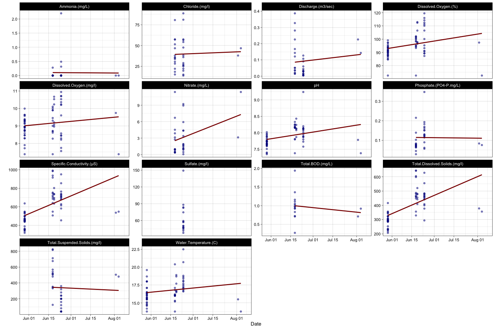
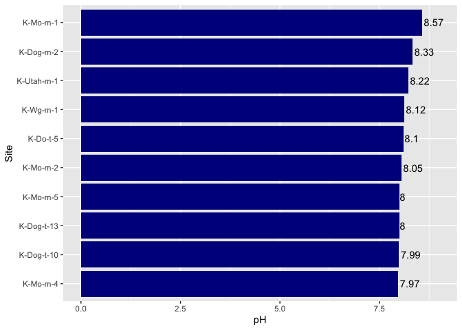
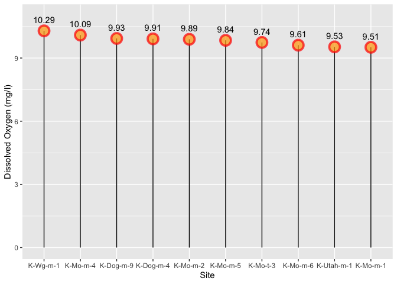
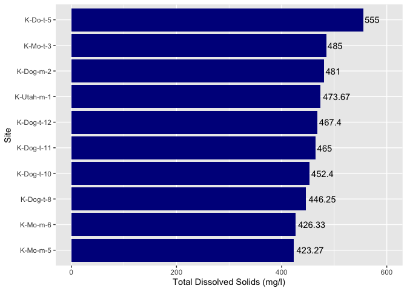

Kickapoo Watershed Water Quality Analysis
================
Houssam Hallouch

## Introduction

In this study, we intend to explore the water quality in the Kickapoo
Watershed. For exploring the water quality using this dataset, different
data cleaning steps were performed.


Through the study we can observe that the concentrations of ammonia,
chloride, discharge, dissolved oxygen saturation, nitrate, pH,
phosphate, specific conductivity, sulfate, total BOD, total dissolved
solids, total suspended solids, and water temperature. Ammonia
concentrations didn’t change significantly over time, chloride
concentrations slightly increased, discharge (m3/sec) slightly
increased, dissolved oxygen saturation moderately increased, nitrate
concentration highly increased, pH was becoming alkaline, phosphate
(PO4-P mg/L), specific conductivity (S), sulfate (mg/l), total BOD
(mg/L), total dissolved solids (mg/l), total suspended solids (mg/l),
and water temperature (°C) slightly increased over time. We can also
observe that the highest Alkaline type water was observed from K-Mo-m-1
site and the highest amount of total dissolved solids in water was
observed from K-Do-t-5 site. But the highest amount of essential oxygen
dissolved in water was observed from K-Wg-m-1 site. Overall, different
problematic elements and dissolved solid particles exhibit excessive
increments over time in different sites, which can be a threat to
nature.

## Dictionary

This dataset represents water quality and parameters measured in the
Kickapoo Watershed. There were 84 observations for 17 attributes in the
dataset. The variables are described below.

1.  Site.code: A unique code or identity assigned to each sample site in
    the Kickapoo Watershed.
2.  Sample.Date: The date the water sample was obtained for testing.
3.  Notes: Notes taken while collecting sample.
4.  Nitrate (mg/L): Nitrate concentration, a kind of nitrogen, measured
    in milligrams per liter. Nitrate levels beyond a certain threshold
    can indicate pollution and have consequences for water quality and
    aquatic life.
5.  Ammonia (mg/L): The concentration of ammonia, a nitrogen chemical,
    measured in milligrams per liter. Ammonia levels can be used to
    detect pollution and have an impact on aquatic ecosystems.
6.  Phosphate (PO4-P mg/L): Phosphate, a kind of phosphorus,
    concentration measured in milligrams per liter. Excess phosphorus
    levels can cause eutrophication, resulting in algal blooms and
    disturbing aquatic ecosystems.
7.  Chloride (mg/l): The concentration of chloride ions in milligrams
    per liter. Chloride concentrations can be impacted by a variety of
    variables, including industrial and agricultural operations, and
    high chloride concentrations can have an impact on water quality.
8.  Sulfate (mg/l): Sulfate ion concentration measured in milligrams per
    liter. Natural processes, as well as industrial and agricultural
    activity, can all have an impact on sulfate levels. High sulfate
    levels can have an impact on water quality and aquatic life.
9.  Total BOD (mg/L): Total Biochemical Oxygen Demand, measured in
    milligrams per liter. BOD is a measure of the quantity of oxygen
    required for organic matter decomposition in water. High BOD levels
    can signal pollution and the possibility of oxygen depletion in
    bodies of water.
10. Total Suspended Solids (mg/l): A measurement of the concentration of
    suspended particles or solids in water in milligrams per liter.
    Sediment, organic debris, and other particles that influence water
    clarity and have ecological consequences are examples of suspended
    solids.
11. Discharge (m3/sec): The volume of water flowing through a certain
    place in a river or stream each second, measured in cubic meters per
    second. Discharge is a measure of water flow rate that is frequently
    measured in order to better understand the dynamics of water
    movement in the watershed.
12. Water Temperature (°C): The water temperature at the time of
    measurement, usually expressed in degrees Celsius. Water temperature
    has an impact on aquatic habitats and the behavior and survival of
    aquatic species.
13. Dissolved Oxygen (mg/l): The amount of oxygen dissolved in water,
    expressed in milligrams per liter. Dissolved oxygen is essential for
    aquatic species to breathe and provides information about the health
    of the water body.
14. Dissolved Oxygen (%): The proportion of dissolved oxygen saturation
    in water. It denotes the amount of dissolved oxygen in comparison to
    its maximal solubility at a given temperature and pressure.
15. Specific Conductivity (µS): The ability of a water sample to conduct
    an electric current as measured in microsiemens (S). Dissolved ions
    alter conductivity, which can indicate the existence of dissolved
    particles and the overall mineral content of the water.
16. Total Dissolved Solids (mg/l): The concentration in milligrams per
    liter of all inorganic and organic compounds dissolved in water.
    Minerals, salts, metals, and other substances are included in total
    dissolved solids.
17. pH: A logarithmic scale measurement of the acidity or alkalinity of
    a water sample. pH values vary from 0 to 14, with 7 being neutral,
    below 7 being acidic, and above 7 being alkaline. pH influences
    chemical reactions and the health of aquatic organisms.

## Data Cleaning

1.  Removed the **Notes** variable from the composite dataset.

    ``` r
    composite<-composite[,-3]
    ```

2.  Created a new dataset by removing **Site.code** variable.

    ``` r
    composite1<-composite[,-1]
    ```

3.  Transformed the dataset from wide to long format.

    ``` r
    composite2<-composite1 %>% 
    gather(key = "variables",value = "values",-1)
    ```

4.  Calculated average **pH** by site.

    ``` r
    composite3<-composite %>% group_by(Site.code) %>% summarise(pH=round(mean(pH,na.rm = T),2))
    ```

5.  Selected top 10 sites by the highest average **pH**.

    ``` r
    composite3<-composite3[order(composite3$pH,decreasing = T),][c(1:10),]
    ```

6.  Calculated average **Dissolve Oxygen (mg/l)** by site.

    ``` r
    composite4<-composite %>% group_by(Site.code) %>% summarise(`Dissolved.Oxygen.(mg/l)`=round(mean(`Dissolved.Oxygen.(mg/l)`,na.rm = T),2))
    ```

7.  Selected top 10 sites by the highest average **Dissolve Oxygen
    (mg/l)**.

    ``` r
    composite4<-composite4[order(composite4$`Dissolved.Oxygen.(mg/l)`,decreasing = T),][c(1:10),]
    ```

8.  Calculated average **Total Dissolved Solids (mg/l)** by site.

    ``` r
    composite5<-composite %>% group_by(Site.code) %>% summarise(`Total.Dissolved.Solids.(mg/l)`=round(mean(`Total.Dissolved.Solids.(mg/l)`,na.rm = T),2))
    ```

9.  Selected top 10 sites by the highest average **Total Dissolved
    Solids (mg/l)**.

    ``` r
    composite5<-composite5[order(composite5$`Total.Dissolved.Solids.(mg/l)`,decreasing = T),][c(1:10),]
    ```

## Attributes by Date

``` r
composite2 %>% 
  ggplot(aes(x=Sample.Date,y=values)) +
  geom_point(col='blue4',alpha=0.5)+
  geom_smooth(method = lm,se=F,col='red4')+
  facet_wrap(variables~.,scales = "free_y")+
  labs(x='Date',y='')+
  theme_linedraw()
```

    ## `geom_smooth()` using formula = 'y ~ x'

<!-- -->

From the above dot plot with trend line, we can observe the changes in
each of those indicators over time. The above plots showed that

- Ammonia (mg/L): Ammonia concentrations didn’t change significantly
  over time.

- Chloride (mg/l): Chloride concentrations slightly increased over time.

- Discharge (m3/sec): Water flow rate slightly increased over time.

- Dissolved Oxygen (%): The proportion of dissolved oxygen saturation in
  water moderately increased over time

- Dissolved Oxygen (mg/l): The amount of oxygen dissolved in water
  slightly increased over time.

- Nitrate (mg/L): Nitrate concentration highly increased over time.

- pH: Water is becoming Alkaline over time.

- Phosphate (PO4-P mg/L): Phosphorus levels did change significantly
  over time.

- Specific Conductivity (µS): Specific conductivity highly increased
  over time.

- Sulfate (mg/l): Sulfate ion concentration observations weren't stored
  on multiple periods of time.

- Total BOD (mg/L): Total Biochemical Oxygen Demand slightly decreased
  over time.

- Total Dissolved Solids (mg/l): The concentration in milligrams per
  liter of all inorganic and organic compounds dissolved in water highly
  increased over time.

- Total Suspended Solids (mg/l): Total Suspended Solids slightly
  decreased over time.

- Water Temperature (°C): The water temperature slightly increased over
  time.

## Top 10 Sites by Average Alkaline pH

``` r
composite3 %>% 
  ggplot(aes(x=reorder(Site.code,pH),y=pH)) +
  geom_bar(stat = 'identity',fill='blue4')+
  ylim(0,9)+
  geom_text(aes(label=pH),hjust=-.1)+
  labs(y='pH',x='Site')+
  coord_flip()
```

<!-- -->

The above bar chart showed that, on average from **K-Mo-m-1** site the
highest Alkaline type water is observed, the second highest Alkaline
type water is observed at **K-Dog-m-2** site, and the third highest
Alkaline type water is observed at **K-Utah-m-1** site.

## Top 10 Sites by Dissolve Oxygen (mg/l)

``` r
composite4 %>% 
  ggplot(aes(x=rev(reorder(Site.code,`Dissolved.Oxygen.(mg/l)`)),y=`Dissolved.Oxygen.(mg/l)`)) +
  geom_segment( aes(x=rev(reorder(Site.code,`Dissolved.Oxygen.(mg/l)`)), xend=rev(reorder(Site.code,`Dissolved.Oxygen.(mg/l)`)), y=0, yend=`Dissolved.Oxygen.(mg/l)`)) +
  geom_point( size=5, color="red", fill=alpha("orange", 0.3), alpha=0.7, shape=21, stroke=2) +
  #geom_bar(stat = 'identity',fill='blue4')+
  geom_text(aes(label=`Dissolved.Oxygen.(mg/l)`),vjust=-1.3)+
  ylim(0,11)+
  labs(y='Dissolved Oxygen (mg/l)',x='Site')
```

<!-- -->

The above lolipop chart showed that, on average from **K-Wg-m-1** site
the highest amount of essential oxygen dissolved in water is observed,
the second highest amount of essential oxygen dissolved in water is
observed at **K-Mo-m-4** site, and the third highest amount of essential
oxygen dissolved in water is observed at **K-Dog-m-4** site.

## Top 10 Sites by Total Dissolved Solids (mg/l)

``` r
composite5 %>% 
  ggplot(aes(x=reorder(Site.code,`Total.Dissolved.Solids.(mg/l)`),y=`Total.Dissolved.Solids.(mg/l)`)) +
  geom_bar(stat = 'identity',fill='blue4')+
  geom_text(aes(label=`Total.Dissolved.Solids.(mg/l)`),hjust=-.1)+
  ylim(0,600)+
  labs(y='Total Dissolved Solids (mg/l)',x='Site')+
  coord_flip()
```

<!-- -->

The above bar chart showed that, on average from **K-Do-t-5** site the
highest amount of total dissolved solids in water is observed, the
second highest amount of total dissolved solids in water is observed at
**K-Mo-t-3** site, and the third highest amount of total dissolved
solids in water is observed at **K-Dog-m-2** site.

## Conclusion

The visualizations showed that there are some serious issues regarding
water quality among sample sites in the Kickapoo Watershed. Nitrate
concentration is increasing over time, which indicates pollution and has
consequences for water quality and aquatic life. We can also observe
that specific conductivity and total dissolved solids are also
increasing over time, which indicates that all inorganic and organic
compounds dissolved in water, such as minerals, salts, metals, and other
substances, are increasing over time. Next, we can observe that the
dissolved oxygen is also increasing, which is essential for aquatic
species to breathe and good for the health of the water body.
